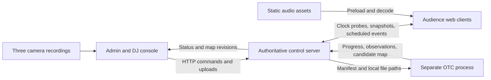

# Audience Orchestra: master implementation plan

Handoff baseline: 2026-09-19, Git tag `foundation-v1`. The repository foundation is implemented and verified. Concert features and the performance targets below remain assigned implementation work; passing scaffold checks does not establish physical audio or camera performance.

Integration update (2026-09-19): all four development branches are merged into main. Local software implementation and evidence are tracked in [.devcontext/stages/05-integration-rehearsal.md](.devcontext/stages/05-integration-rehearsal.md) and [README.md](README.md). The user deferred Railway deployment until after local review. The original foundation handoff below remains historical; physical acceptance targets in this plan are unchanged.

## Team handoff: start here

Current concert scope (user update, 2026-09-19): exactly three musical channels, **Melody, Vocals and Percussion**. The four development teams/branches remain unchanged. See the [three-channel decision](.devcontext/decisions/20260919-three-show-channels.md).

Stage UI update (user request, 2026-09-19): one public origin serves audience `/`, operator `/admin`, projector QR/counts `/present`, and camera-crew `/upload`. The admin uses one page with Reset, Calibration, Assign and Performance. Audience joins, clock sync and asset verification are automatic; sound is attempted automatically with one gesture only when the browser requires it. After calibration, mapped phones display their section and unmapped phones choose left/center/right. See the [stage guide](docs/stage-dashboard.md) and [accepted workflow decision](.devcontext/decisions/20260919-single-domain-stage-workflow.md).

Give each teammate this file, [rules.md](rules.md), and their stage brief from the table below. Work on the assigned branch in a separate clone/worktree; continue from the shared foundation.

1. Read [README.md](README.md) for setup, then `AGENTS.md`, `rules.md`, `.devcontext/README.md`, and your stage/status/handoff files.
2. Install **Bun 1.3.14**, run `bun install --frozen-lockfile`, and run your focused gate. Team 3 additionally installs **Python 3.13** and runs `bun run setup:python`. The other teams do not need Python for their own gate.
3. Record `git rev-parse foundation-v1` and your current branch/commit in a new team journal. Assign human lead names; Team 1's lead is the default integration captain.
4. Start the first slice in your brief, extend its tests, and keep status/handoff current. Send contract changes to the captain with producer/consumer examples before changing the boundary.

| Team / branch | Ready-to-copy assignment and first slice | Independent gate |
| --- | --- | --- |
| 1 / `feat/sync-control` | [Clock, identity, and control](.devcontext/stages/01-sync-control.md): extract and characterize the clock before adding authoritative state | `bun run gate:sync` |
| 2 / `feat/audio-client` | [Audio and audience](.devcontext/stages/02-audio-client.md): unlock/preload/scheduled click against an injected clock; render the frozen packet | `bun run gate:client` |
| 3 / `feat/otc-localization` | [Optical localization](.devcontext/stages/03-otc-localization.md): independent decoder tests, then one actual recorded screen | `bun run gate:otc` |
| 4 / `feat/admin-console` | [Admin and DJ](.devcontext/stages/04-admin-console.md): pure selection geometry, then mock-backed commands and workflow | `bun run gate:admin` |

**Available now:** backend/client/admin shells; shared Zod and generated Python schemas; exhaustive OTC codebook/golden packets; original synthetic audio and JSON fixtures; loopback HTTP/WS mocks; Python validation/replay CLI; four gates; CI configuration; `.devcontext` handoffs. **Still to build:** the NTP estimator/lifecycle, real joins and control APIs, audio engine, flash renderer, video decoder/registration, interactive admin workflows, load/e2e harnesses, and physical rehearsal. Backend feature routes explicitly return 501 and real OTC processing exits nonzero until implemented. The mock's 1,500 device records are not a socket load test.

The baseline and four branches are created locally. Remote publication is a separate captain action documented in the README. A teammate on another machine must fetch the published baseline first. Hardware/deadline inputs in section 12 should be resolved early; they do not block work against the committed contracts.

## 1. Outcome and scope

Build a browser-based concert in which audience phones play different, synchronized musical parts according to their position in the auditorium. An operator calibrates the audience from three uploaded camera recordings, reviews a device map, selects regions, assigns channels, and conducts a prepared set from a multitrack timeline.

The first complete demonstration must work with 12-30 real phones, three camera views, and three prepared stems (Melody, Vocals and Percussion). The system must also be exercised with 1,500 simulated connections. A simulated load test does **not** establish that the venue Wi-Fi, optical coverage, or 1,000 physical phone speakers will work; those need a venue rehearsal.

The four workstreams are:

1. **Sync and control:** extract the BeatSync clock, own authoritative server state, and implement channel subscriptions and scheduled commands.
2. **Audio and audience client:** extend playback to multiple channels and build joining, readiness, calibration rendering, and the participant experience.
3. **Optical localization:** decode moving phone screens from recordings and produce a confidence-scored audience map.
4. **Admin and DJ console:** upload recordings, review localization, select devices, and operate the shared musical timeline.

### What was inspected

- The user supplied `beatsync-source/`; its relevant clock, playback, server, schema, test, and license files have been inspected. The new workspace foundation has since been built independently of that reference.
- BeatSync uses Bun, Hono, Next.js/React, Zustand, Zod, and Bun tests. Its MIT license identifies copyright (c) 2025 freeman-jiang. Provenance is recorded in `.devcontext/beat-sync-extraction.md`; `epochNow()` is the only function extracted so far. The reference two-phone demonstration and timing characterization remain Team 1/2 work.
- **User requirement:** selectively extract reused implementation into this project's main folders. Keep `beatsync-source/` as an unchanged reference; the finished application must build and run without importing or serving anything from it.
- The documentation convention follows `C:\Projects\Lattice\.devcontext`: an index, current architecture, glossary, stage briefs with acceptance criteria and evidence, schema notes, and append-only architecture decisions. Its application architecture is not being copied.

### Initial decisions and assumptions

| Topic | Baseline decision | Verification or revision trigger |
| --- | --- | --- |
| Position | An approximate 2D audience map relative to the stage; no GPS or metric 3D reconstruction | Check ordering against known seats in the venue |
| Audio | Preloaded assets, a common show timeline, and scheduled Web Audio playback | Physical iOS/Android rehearsal |
| Routing | One active logical channel per phone; many simultaneous channels across the crowd | Three channels: Melody, Vocals and Percussion |
| Music | Prepared, compatible stems with explicit timeline offsets | Musical rehearsal; no automatic separation or beat matching |
| Calibration | An error-checked temporal packet lasting about 11 seconds initially | Shorten only after camera, decoding, and flash-pattern validation |
| Cameras | Three fixed 4K phones, one primarily covering each audience column, with overlap | Back-row visibility and actual codec/frame timing tests |
| Stack | Bun 1.3.14/Hono backend, Next.js/React frontends, shared TypeScript/Zod, Python 3.13 worker; OpenCV and FFmpeg/PyAV decoding planned | JS and Python validation dependencies are locked; Team 3 pins the video toolchain after codec testing |
| Deployment | One authoritative control process and one separately executed video worker; static media over HTTP(S) | Scale only if measurements demonstrate a bottleneck |
| Schedule | An illustrative 36-hour implementation window | Team leads compress milestones to the actual deadline |

Do not promise one-second calibration or perfect acoustic alignment across the hall. At full 11-bit utilization, every raw binary word is a valid ID, so a single bad bit can silently identify another phone. Clock synchronization also does not remove speaker latency or the travel time of sound through the room.

### MVP boundary

Include QR join, resume after reconnect, audio unlock, reusable clock synchronization, three channels (Melody, Vocals and Percussion), calibration capture/upload, device localization with explicit unknowns, manual column fallback, rectangle/lasso selection, scheduled reassignment, prepared multitrack playback, readiness counts, and an emergency mute.

Defer automatic stem separation, live audio streaming, full DAW editing, time stretching, arbitrary audio effects, metric 3D seating reconstruction, continuous camera tracking during music, native apps, and distributed server infrastructure. A DaVinci-style timeline is the interaction reference, not a request to recreate DaVinci Resolve.

## 2. Architecture and four-branch ownership



The WebSocket connection carries control and synchronization messages, never the audio stream or video bytes. The worker cannot block the control event loop or write authoritative assignments. An operator commits a reviewed mapping; the server then owns it.

### Branch and directory matrix

| Team | Feature branch | Exclusive implementation ownership | Independent deliverable |
| --- | --- | --- | --- |
| 1 | `feat/sync-control` | `backend/`, `packages/sync/`, `tools/load/` | Control server and simulated clients, with fake media/OTC adapters |
| 2 | `feat/audio-client` | `client-frontend/`, `packages/audio/`, `tools/client-demo/` | Real browser client driven by a local protocol mock |
| 3 | `feat/otc-localization` | `workers/otc/`, `tools/otc-fixtures/` | CLI converting fixture recordings and a manifest into validated results |
| 4 | `feat/admin-console` | `admin-frontend/`, `packages/selection/`, `tools/admin-demo/` | Full operator workflow against a deterministic mock server |

Designate the Team 1 human lead as integration captain, unless the four teammates choose someone else before splitting. The captain alone edits root package/configuration files, lockfiles, CI, `packages/contracts/`, and shared `packages/testkit/` files. Other teams propose contract changes with examples; ownership does not grant unilateral authority to change another team's interface.

Each team owns its corresponding `.devcontext/stages/` brief and `.devcontext/teams/<team>/` directory. Any team can add a uniquely named ADR. The captain curates shared architecture and schema summaries. Ownership applies to files, not just folders named in a PR description.

Implemented repository structure (comments describe intended responsibilities, not completed features):

```text
backend/                      # HTTP, WebSocket, registry, routing, job adapter
client-frontend/              # QR landing and audience experience
admin-frontend/               # map, calibration workflow, musical timeline
packages/contracts/           # Zod schemas, generated JSON Schema, examples, codebook
packages/sync/                # clock estimation and time conversion, independent of UI/audio
packages/audio/               # preload, output-clock adapter, scheduled channel playback
packages/selection/           # pure geometry to select device IDs
packages/testkit/             # small shared fixtures and clock/transport test doubles
workers/otc/                  # Python CLI, decoder, tracking, camera registration
tools/{load,client-demo,otc-fixtures,admin-demo}/
fixtures/                     # synthetic JSON, original tones; recorded MP4 fixtures pending
.devcontext/                  # committed development memory; see rules.md
runtime/                      # ignored uploads, recordings, jobs, media, local state
beatsync-source/               # unchanged reference; excluded from active workspaces
```

### BeatSync extraction map

Paths in the first column are relative to `beatsync-source/`. Extract only the required functions and their focused tests, then adapt imports. Do not copy the entire application store or room manager just to obtain a small behavior.

| Inspected source | Destination / owner | Preserve and change |
| --- | --- | --- |
| `packages/shared/utils.ts` (`epochNow`) and NTP constants | `packages/sync/`, Team 1 | Preserve the monotonic-backed `performance.timeOrigin + performance.now()` clock; add injected clocks and explicit epoch handling |
| `apps/client/src/utils/ntp.ts` and `utils/__tests__/ntp.test.ts` | `packages/sync/`, Team 1 | Preserve coded probe-pair validation and minimum-RTT offset selection; move module-global pair state into a session instance |
| `apps/client/src/hooks/useNtpHeartbeat.ts` and its tests | Core lifecycle in `packages/sync/`; thin React adapter in `client-frontend/` | Separate probe scheduling from React and Zustand; reset on reconnect; jitter startup at scale |
| `apps/server/src/routes/websocketHandlers.ts` NTP receive path; `websocket/handlers/ntpRequest.ts` | `backend/src/sync/`, Team 1 | Capture receive time immediately and send time immediately before reply; retain cheap validation even on the fast path |
| `apps/server/src/managers/RoomManager.ts` scheduling, load coordination, and `syncClient` | Focused modules under `backend/src/`, Team 1 | Generalize single-source readiness/playback into per-device/per-show readiness and channel subscriptions |
| `apps/client/src/lib/audioContextManager.ts` | `packages/audio/`, Team 2 | Reuse one AudioContext, resume/interruption handling, wake-lock lifecycle, and the performance/audio clock adapter as appropriate |
| `apps/client/src/store/global.tsx` loading, cache, `schedulePlay`, `playAudio`, pause | `packages/audio/` plus a small client store, Team 2 | Extract buffer/scheduling logic; replace one selected URL/source and automatic playlist advancement with authoritative show/channel playback |
| `apps/client/src/hooks/useWebSocketReconnection.ts`, `websocket/dispatch.ts`, registry patterns | `client-frontend/`, Team 2 | Reuse connection/dispatch patterns; add authenticated identity resume and full revisioned snapshots |
| Relevant parts of `packages/shared/types/` | `packages/contracts/`, captain with Teams 1/2 | Retain Zod validation patterns; define the new protocol rather than retaining unrelated old messages |
| `apps/server/src/__tests__/audioLoadingCoordination.test.ts`, socket tests, `scripts/load-test-demo.ts` | `backend/` tests and `tools/load/`, Team 1 | Port useful scenarios; extend to channels, stale preparation ACKs, and the 1,500-client case |

Source-specific findings that affect the work:

- Probe defaults are 16 measurements, 50 ms startup interval, 25 ms inter-probe gap with 5 ms tolerance, and 2,500 ms steady interval. Preserve a characterized baseline, then measure startup storms and stagger initialization. Batch telemetry, not timestamp capture or probe replies; preserve the measured inter-probe gap.
- `epochNow()` already uses a monotonic clock with an epoch-shaped origin. It does not need replacement with `Date.now()`. Some heartbeat/liveness timers separately use wall-clock time; keep scheduling domains explicit.
- `global.tsx` combines clock offset with manual audio nudge and subtracts filtered output latency. **Only pure clock offset belongs in optical timing.** Audio compensation and manual nudge must never move a calibration symbol.
- `audioContextManager.ts` contains `perfTimeToAudioTime()`, but the inspected store playback path also schedules via `AudioContext.currentTime + delay`. Select one characterized output-timing method; do not combine both and compensate latency twice.
- Playback has a single selected source and stops the previous source when creating a new one. The cache is limited to three buffers. Both behaviors need deliberate adjustment for prepared channel switches and three preloaded stems.
- The existing source can have multiple queued tracks; its limitation here is one room-wide playing source, not an inability to list multiple files.
- Its NTP fast path bypasses the general Zod parser. Preserve early timestamps while validating finite timestamps, pair indices, membership, and size before replying.
- The reference root package pins `bun@1.3.8`, while its `mise.toml` specifies Bun `1.3.14`. The new workspace consistently pins and has been tested with Bun `1.3.14`.

Preserve the complete BeatSync MIT notice in the existing `THIRD_PARTY_NOTICES.md`. Record each extraction's source path, upstream revision or source-file hash, destination, retained behavior, deliberate changes, and migrated tests in `.devcontext/beat-sync-extraction.md`. Do not copy chat, music search/providers, analytics, advertising, IP geolocation, the old spatial-volume scene, cloud backups, or bundled commercial songs unless a concrete requirement emerges. IP/geographic location does not solve seat location.

## 3. Foundation baseline and remaining first experiments

The software foundation is delivered as `foundation-v1`: pinned dependencies, application shells, protocol v1 schemas and examples, 2,048 codewords, packet vectors, 30-device/1,500-device fixtures, original tones, a fake clock, HTTP/WS mocks, Python validation/replay, branch gates, CI, and team context. See [foundation evidence](.devcontext/evidence/foundation/verification.md) and [Stage 00](.devcontext/stages/00-foundation.md) for the exact checks and limitations.

`git rev-parse foundation-v1` identifies the common base; all four local feature branches are created at that commit. The tag is the canonical immutable baseline reference, avoiding a self-referential SHA in the commit that creates this document. Each team records the resolved SHA in its first journal.

Do not repeat scaffold setup. Preserve the source-free build boundary and the executable schemas. Future extraction updates the existing `THIRD_PARTY_NOTICES.md` and provenance ledger. The following original foundation experiments remain explicit first team milestones, rather than blocking independent coding:

- Teams 1/2: reproduce the unmodified BeatSync two-device baseline in a disposable copy, port focused tests, and characterize timing before adapting the estimator/audio path.
- Team 3: obtain original camera clips and inspect near/back-row pixels; select/pin FFmpeg/PyAV/OpenCV based on actual codecs. No recorded MP4 is supplied by the foundation.
- All leads: record deadline, human owners, venue access, supported phone sample, and music. Review shared fixtures before proposing any interface changes.

The foundation does not claim synchronization, decoding, browser-interaction, load, or venue tests passed. Stage briefs define how each team replaces its shell/seam with real behavior and extends its gate.

### Branch/worktree setup

The local branches already exist. On a shared Windows machine, use separate worktrees outside OneDrive's synchronized directory when practical; teammates on different machines can use ordinary clones after the captain publishes the refs. Worktree creation is left to each lead so machine paths are chosen locally.

```powershell
# Run from the repository containing the existing four local branches.
# These destination directories must be new or empty.
git worktree add C:/Projects/HTN-worktrees/sync-control feat/sync-control
git worktree add C:/Projects/HTN-worktrees/audio-client feat/audio-client
git worktree add C:/Projects/HTN-worktrees/otc-localization feat/otc-localization
git worktree add C:/Projects/HTN-worktrees/admin-console feat/admin-console
```

Never have multiple agents changing branches or installing dependencies in the same working directory. Each team lead assigns agents non-overlapping files or additional private worktrees. The four named branches remain the long-lived team integration branches.

## 4. Shared contracts and invariants

The executable schemas in `packages/contracts/src/` and approved ADRs define the exact wire representation. The following explains their semantics; update this plan when a material decision changes. Structural validation does not replace the server's authorization, uniqueness, referential integrity, or revision checks.

### Identity, time, and state

| Field or entity | Required meaning |
| --- | --- |
| `sessionId` | Unique concert session; every message and recording manifest belongs to one session |
| `serverEpoch` | Changes whenever the server's monotonic clock origin changes; old scheduled actions are invalid |
| `deviceId` | Integer **0 through 2047**, allocated sequentially and never recycled during a session; zero is valid |
| `resumeToken` | Opaque credential for reclaiming a device identity; separate from the public optical ID |
| `commandId` | Unique mutation ID; retrying the same command has the same result |
| `revision` | Server-assigned monotonically increasing state revision; consumers reject stale state |
| `serverMs` | Milliseconds from the server's monotonic-backed `epochNow()`; always paired with `serverEpoch`, never fresh `Date.now()` values |
| `effectiveServerMs` | Future execution time, expressed in the same epoch; receipt time is not execution time |
| `trackId` | One immutable audio asset with URL, content hash, byte size, duration, and decoded format |
| `channelId` | Logical musical lane to which phones are assigned; distinct from an audio asset |
| `showRevision` | Immutable prepared timeline version; clips reference tracks, channels, offsets, and gain |
| `mapRevision` | Committed location snapshot used for selections and assignments |

An allocated ID survives a network reconnect. Authenticate the resume token; never allow a client to claim another ID by number. Define concurrent-tab behavior: a new authenticated connection replaces the previous connection for that identity. A second independent join without the token gets a new ID. Reject joins after capacity rather than wrapping the counter.

Use one authoritative state writer. For the MVP, keep hot state in memory and serialize durable identity/show/map/assignment mutations into an atomic local JSON checkpoint; serialize writes and acknowledge durable mutations only after success. Do not persist every clock probe or heartbeat. On restart, restore identities and the last committed show/map, issue a new clock epoch, clear pending actions, and return to stopped. Clients resynchronize before becoming ready. Adapt existing BeatSync storage if it already solves this simply.

### Clock boundary

`packages/sync/` exposes `nowServerMs()`, `toLocalPerformanceMs(serverMs)`, quality/age information, and synchronization lifecycle hooks. It does not import React, canvas, Web Audio, or the optical decoder.

For an NTP-style exchange, let `c0/c3` be client send/receive times and `s1/s2` server receive/send times, all in milliseconds on their respective monotonic clocks:

```text
offset(server - client) = ((s1 - c0) + (s2 - c3)) / 2
networkDelay = (c3 - c0) - (s2 - s1)
```

Start from the inspected coded-pair/minimum-RTT estimator and preserve its focused tests. Add sample age and measured quality; add drift fitting only if measured drift warrants it. Estimated uncertainty is a quality signal, not proof of true clock error under asymmetric networks. Reprobe periodically with jitter, and immediately after reconnect or returning to the foreground. With BeatSync's epoch-shaped client clock, `toLocalPerformanceMs(S) = S - offsetEstimate - performance.timeOrigin`; do not subtract an audio nudge here. Inject clock and transport for deterministic tests.

For the user's cellular/hotspot testing, participant readiness now defaults to an explicit `internet` policy: best observed RTT <=300 ms (estimated uncertainty <=150 ms) and an accepted sample age <=10 seconds. `NEXT_PUBLIC_CLOCK_PROFILE=strict` restores the original <=40 ms RTT / <=3.75-second freshness policy; shared estimator/operator defaults stay strict. The 16-pair warmup, 5 ms pair-gap filter, actual uncertainty reporting and epoch invalidation remain. This broadens eligibility, not the physical timing acceptance targets below. See the [readiness decision](.devcontext/decisions/20260919-internet-clock-readiness.md).

### Minimum HTTP and WebSocket surface

Endpoint names below are the initial contract. Commands return either a validated result and revision or a structured error; a transport ACK means receipt, not successful execution.

| Interface | Responsibility |
| --- | --- |
| `POST /api/sessions/:sessionId/join` | Allocate/resume identity and issue the participant connection credential |
| `GET /api/sessions/:sessionId/snapshot` | Role-filtered current state, including pending scheduled actions |
| `GET /api/assets/:trackId` | Static/cacheable media, preferably served independently from control |
| `POST /api/assets` | Operator-only audio upload/registration with validated asset metadata |
| `POST /api/calibrations` | Create run and freeze participants, codebook version, palette, timing, and run tag |
| `POST /api/calibrations/:runId/arm` | Commit future start after preparation/readiness |
| `POST /api/calibrations/:runId/uploads` | Stream one camera file with camera ID, primary column, and capture metadata |
| `POST /api/calibrations/:runId/jobs` | Enqueue an OTC job referencing completed uploads and camera geometry |
| `GET /api/jobs/:jobId` | Read progress, errors, diagnostics, and candidate result |
| `POST /api/calibrations/:runId/commit-map` | Commit reviewed results against the expected current map revision |
| `POST /api/assignments` | Assign an explicit device-ID set to a channel at a future time |
| `PUT /api/show` | Validate/save a prepared show revision while stopped |
| `POST /api/transport` | Prepare/play/pause/seek/stop with authoritative scheduled state |
| `POST /api/mix` | Schedule channel/master gain and mute/solo changes without modifying asset timing |
| `POST /api/panic` | Immediately invalidate pending playback and broadcast mute |
| WebSocket | `clock.probe/reply`, `state.snapshot`, `calibration.prepare/ready/arm/result`, `assets.prepare/ready`, `assignment.prepare/ready/commit`, `transport.prepare/ready/commit`, `mix.commit`, `device.status`, `panic` |

Use an envelope with `protocolVersion`, `sessionId`, `serverEpoch`, `type`, `messageId`, and `payload`; state events also carry `revision`, and scheduled events carry `effectiveServerMs`. Client clock probes correlate replies with their probe ID. Client mutation requests carry `commandId` and relevant expected revision. Snapshot/resume is mandatory; correctness must not depend on receiving every broadcast.

Keep state ordering separate from cancellation: a newer unrelated mix update must not cancel an already accepted transport start. Pending actions carry their domain revision (`transportRevision`, per-device `assignmentRevision`, or `mixRevision`) and any explicit superseded command ID. MVP permits one pending transport change and one pending assignment change per device; replacement in the same domain explicitly cancels the prior pending change. Snapshots include both effective state and pending actions.

The public QR code only grants participant access. Admin commands/uploads require a separate operator credential. Bind a participant socket to its authenticated device, validate message shape/size, and limit join/upload rates. The OTC worker accepts server-resolved local file paths; never execute an uploaded filename as shell code. Do not build a general account system.

### Calibration and worker interchange

`CalibrationManifest` contains `protocolVersion`, `sessionId`, `serverEpoch`, `runId`, `runTag`, frozen `participantIds`, `startServerMs`, packet/palette/codebook versions, `symbolMs`, and one entry per camera: `cameraId`, `primaryColumn`, local video path/hash, rotation metadata, exclusion ROIs, and optional ordered map anchors.

`OtcResult` contains the same run identity, input hashes, decoder version, per-camera diagnostics, observations, candidate locations, and rejected/ambiguous observations with reasons. Each observation records camera/frame coordinates, track ID, decoded device ID if accepted, sampling/correction evidence, and a quality score. A score is not a calibrated probability unless measurements establish that interpretation.

A location records `deviceId`, normalized `x/y` or null, `column`, `mappingMode`, source cameras, `decodeScore`, mapping residual/uncertainty where available, and status: `localized`, `coarse`, `ambiguous`, or `unseen`. Distinguish a manually selected column from an optically decoded position. Never turn an unknown into `(0,0)`.

The Python CLI reads a manifest and writes a schema-valid result plus optional debug overlays. It emits structured progress on stdout and diagnostic logs on stderr. The server owns queuing, timeouts, cancellation, and exit/error handling. Default to one job at a time; no Redis, broker, or Python HTTP service is required.

### Coordinates and selections

Canonical map: stage at the top, `y=0` nearest the stage, `y=1` at the back; `x=0` is the audience's left **while facing the stage**, `x=1` their right. Camera image coordinates are top-left-origin pixels and may be horizontally reversed relative to this map. Explicitly verify orientation with a known person in each corner.

Column names `left`, `center`, and `right` always use that audience convention. A selection resolves to an explicit ID set and `mapRevision`; later camera processing cannot silently change its membership. Reject a stale-map assignment and ask the operator to reselect. Last committed assignment wins for overlapping selections at the same effective time; server revisions determine order. Unassigned/unlocalized devices remain silent unless explicitly put into a manual fallback channel.

**Manual fallback update (user-confirmed 2026-09-20):** choosing a manual column requests server-owned audio routing, defaulting left → Melody, center → Vocals, right → Percussion. Existing section assignments take precedence; ready manual phones can join the current shared playhead after synchronization and audio checks. Explicit operator overrides remain authoritative. See [manual routing semantics](.devcontext/decisions/20260920-manual-section-audio-routing.md).

## 5. Optical calibration: Team 3's critical path

### 5.1 Prove the optics before optimizing the algorithm

Within the first few hours, film 12-30 actual phones at representative near/middle/back distances. Use the intended cameras, lenses, lighting, orientation, and recording format. Inspect original-resolution crops for screen size, saturation, blur, and whether adjacent screens can be separated. Include hand movement and partial coverage.

As a rough planning calculation, a 7 cm screen at 30 m with a 60-degree horizontal field of view occupies only about `3840 * 0.07 / (2 * 30 * tan(30 degrees)) = 7.8` horizontal pixels before tilt/blur. This is not a camera measurement. Aim for roughly eight or more usable pixels across the smallest screen, then establish the actual decoder limit experimentally. 4K alone does not establish feasibility.

If back-row screens are indistinguishable, change framing, camera position, lens, or the participating area immediately. Code cannot recover two fully overlapping emitters or an invisible screen. Keep all three cameras stationary, use the original files, record several seconds before/after calibration, and lock focus/exposure/white balance where supported. Confirm whether the phone actually produces H.264/HEVC and constant/variable frame timing. Prefer 4K30 if that is the most reliable common mode; use 60 fps only when tested.

### 5.2 Packet v1: eleven identity bits with redundancy

Keep the 11-bit ID capacity, but encode it as an **extended Hamming (16,11) codeword with minimum distance 4**. This supports single-bit correction and double-bit detection under the corresponding error assumptions; larger errors can still turn into a wrong valid word. Tracking, repeated evidence, participant filtering, and rejection remain necessary.

Encoder convention, frozen in the shared codebook:

- Number transmitted codeword positions 1 through 16.
- Put ID bits most-significant first into positions `3,5,6,7,9,10,11,12,13,14,15`.
- Positions `1,2,4,8` hold even parity over positions 1-15 whose binary index contains that parity bit.
- Position 16 is overall even parity over all 16 positions.
- Transmit positions 1 through 16 in that order. ID `0` encodes to all zeros; ID `2047` to all ones. Zero must never mean missing.

Additional checked golden examples: ID `1` -> `1101000100000011`; ID `1024` -> `1110000000000001`. An independent planning calculation enumerated the specified 2,048 codewords and confirmed uniqueness and minimum pairwise distance 4. This verifies the packet mathematics only, not screen/camera decoding.

Use two camera-tested screen colors, represented by exact RGB values in the manifest; the user's blue/red idea is one candidate, not a hard-coded decoder assumption. Use pilot measurements to classify colors rather than ideal RGB thresholds. Prefer a palette without saturated red after testing. No per-device imagery, text, or animation may cover the calibration area.

Initial symbol duration is **200 ms**. The complete packet is:

| Slots, zero-based | Screen state | Purpose |
| --- | --- | --- |
| 0-1 | Neutral/dark | Leading guard |
| 2-3 | Color 0 | Per-screen/camera color pilot |
| 4-5 | Color 1 | Per-screen/camera color pilot |
| 6-12 | `1110010` | Shared timing preamble |
| 13-20 | 8-bit `runTag`, MSB first | Detect clips from the wrong calibration run |
| 21-36 | 16-bit codeword | Identity pass A |
| 37-52 | Bitwise complement of the same codeword | Identity pass B; decoder inverts it before comparison |
| 53-54 | Neutral/dark | Trailing guard |

Total: **55 symbols / 11 seconds**. Allocate run tags without reuse within a concert session; after 256 calibrations begin a new session rather than wrap. The full `runId` remains the authoritative manifest key. The tag detects ordinary stale-clip mixups; it is not authentication. Incorrect/ambiguous tags reject an observation or clip, never get silently repaired into the desired run.

A 200 ms symbol gives approximately six 30 fps frames before transition rejection. At worst, alternating symbols form 2.5 opposing color cycles per second; inspect the actual pattern and palette against the [W3C flash guidance](https://www.w3.org/WAI/WCAG22/Understanding/three-flashes-or-below-threshold.html). Provide a skip-calibration/manual-column route. The web content threshold is not a blanket certification of an auditorium-wide display. Do not accelerate the packet just to meet an assumed one-second goal.

### 5.3 Client and server sequence

1. Freeze a run's participant IDs. Only joined, foreground, opted-in, sufficiently synchronized phones are eligible. New joiners wait for the next calibration or use manual assignment.
2. Send `calibration.prepare` with the immutable `CalibrationPlan` (packet, palette, versions, participant IDs). Clients acknowledge that exact run and version. Arm sends `CalibrationRun`, adding the scheduled start; only after uploads does the worker's `CalibrationManifest` add local camera files/hashes.
3. Confirm all three camera operators are recording; arm for a common future time, initially at least three seconds ahead. Freeze the ready subset and report exclusions. Do not wait indefinitely for every registered phone.
4. The client renders `slot = floor((nowServerMs() - startServerMs) / symbolMs)` from the pure sync clock on each animation frame. Do not increment bits with a chain of timers. A skipped frame must not shift every later bit.
5. If a phone misses the run start, becomes hidden, or loses adequate timing, report failure; do not begin its own delayed packet. Log requested symbol transitions and observed animation-frame lateness as diagnostics, not proof of physical display timing.
6. Upload original recordings labeled with `runId`, camera ID, and primary column. Freeze the completed file hashes before processing. Retain the previous committed map until the new result has been reviewed.

### 5.4 Offline pipeline

1. **Validate and decode video.** Check session/run identity, tag, hashes, duration, codec, rotation, and dimensions. Read actual presentation timestamps through FFmpeg/PyAV; do not use `frameNumber / nominalFPS` for variable-frame-rate clips. [FFprobe](https://ffmpeg.org/ffprobe.html) exposes frame-level information. Stream frames; do not load three uncompressed 4K movies into memory.
2. **Find temporal phase per camera.** Detect pilot/preamble changes in plausible audience ROIs, correlate against the known packet, and estimate its start in clip PTS. The cameras do not need synchronized record buttons. Refine a bounded local phase per screen to accommodate display/rolling-shutter differences; an unconstrained phase search can invent IDs.
3. **Detect candidate screens.** Start with pilot-color/brightness masks, connected components, size/aspect limits, and explicit stage/light exclusion masks. Detect at sufficient resolution to preserve back-row screens. Global phase detection may use reduced frames; final color sampling uses native-resolution ROIs.
4. **Track through the packet.** Use gated position/size/motion association and local optical flow as needed. Search neighboring candidates; avoid a dense 1,000-by-1,000 matching problem on every frame. Track the screen, not a fixed pixel. Split/merged blobs, implausible jumps, and identity crossings reduce confidence or terminate a track. Short missing intervals create erasures; do not interpolate a color across an occlusion.
5. **Sample symbols.** Reject frames near transitions (initially the outer 25% at either edge of each slot). Use robust interior color samples relative to the pilots; reject saturated, mixed, blurred, or tiny observations. Require enough interior evidence per slot. Mark uncertain bits as erasures rather than thresholding everything into 0/1.
6. **Decode bounded valid IDs.** Undo pass B's complement. Decode within the frozen codebook and validate participant membership, exact header and run tag. Require a unique candidate under `2 * errors + erasures < 4`; never choose a nearest active ID outside that bound. Following the user's acceptance update, one valid pass with an unreadable repeat is accepted with an explicit warning. Conflicting repeats, duplicate identities and independent screen collisions stay ambiguous. Size changes and transient fragments alone do not veto a valid code. See [.devcontext/decisions/20260919-valid-code-acceptance.md](.devcontext/decisions/20260919-valid-code-acceptance.md).
7. **Attach identity to observed position.** Preserve the track trajectory and use a documented representative position, initially its median screen center over accepted samples. Store camera-space evidence and uncertainty, not just the final dot.
8. **Register views and fuse duplicates.** Use decoded common IDs, not visual similarity of screens, as correspondences. Apply the mapping rules below. Produce one canonical location per device, with diagnostics explaining rejected alternatives.
9. **Export review material.** Save schema-valid JSON, annotated stills/optional short overlays, decode counts, rejected reasons, camera residuals, processing time, and input hashes. All debug outputs live outside Git unless small and synthetic.

Keep the MVP classical and inspectable. Do not train a detector or implement SLAM unless the early experiments show the simpler approach cannot meet the agreed demonstration scope.

### 5.5 Three-camera registration and mandatory fallback

Implement the manual geometry path first so the demo does not depend on automatic stitching:

- The operator labels each camera's primary column and marks a seating ROI plus four ordered anchors: front-left, front-right, back-right, back-left, all in the canonical audience convention. Warp that approximate seating surface into its normalized column strip. Camera-space screen positions remain available for inspection.
- Current uploads default to an explicit stage-facing `frameLayout` when no corners are marked, producing approximate `frame-layout` positions automatically. Manual corners take precedence. Legacy manifests without either geometry declaration remain column-only. See [.devcontext/decisions/20260919-automatic-frame-layout.md](.devcontext/decisions/20260919-automatic-frame-layout.md).
- The resulting map is an approximate audience layout, not measured floor coordinates. Tiered rows, different phone heights, and camera translation create parallax. A homography models a plane or the appropriate rotational case; it does not generally solve arbitrary 3D crowds. [OpenCV's homography tutorial](https://docs.opencv.org/4.x/d9/dab/tutorial_homography.html) documents the underlying geometry.
- Add automatic overlap registration using accepted common device IDs. At least four non-collinear pairs are needed to fit a homography; require more, initially eight well-spread matches, plus inlier and held-out residual checks before trusting it. A narrow strip of matches must not authorize extrapolation across the entire hall.
- Prefer a decoded view from the device's valid primary-column ROI, then measured observation quality. Fuse positions only when they agree within the accepted mapping tolerance. Conflicting IDs in the same camera, reflections, or contradictory cross-camera positions must be flagged, not averaged away.
- If shared IDs are insufficient, the overlap graph is disconnected, or parallax produces bad residuals, retain the manual column transforms. Never require all three cameras to stitch before any locations are usable.
- If geometry itself cannot establish a trustworthy row coordinate, mark the device `coarse` and expose column selection only. Participants who skip/fail optical calibration can explicitly choose left/center/right; mark that source as manual. Do not claim a self-selected column is an optical fix.

Recalibrate only a declared target set if necessary. On map commit, replace those targets' locations, mark failed targets unseen/ambiguous, and retain nonparticipants' previous positions. Reject an older run trying to overwrite newer locations. Permit only one active calibration run at a time in the MVP. Moving to a new seat after calibration requires recalibration or manual reassignment; ordinary hand movement does not imply continuous seating tracking.

### 5.6 Failure matrix

| Condition | Required behavior |
| --- | --- |
| Mild hand motion | Track moving ROI; decode using interior samples |
| Partial cover or dropped frames | Erasures, code-bound check, second-pass evidence |
| Complete occlusion or two indistinguishable overlapping screens | Unknown; retry/manual route |
| Two tracks cross or blobs merge | Reject ambiguous association instead of swapping identities |
| Rolling shutter or transition smear | Per-track phase/guard windows; mixed-frame rejection |
| Color shift, HDR, exposure pumping | Pilot-normalized classification; flag insufficient separation |
| Stage lights, projector, reflections | Exclusion masks, packet/tag match, duplicate-location checks |
| Handheld camera shake | Prefer re-recording on a fixed support; add stabilization only if essential |
| Missing one camera / no overlap | Process available cameras and use manual column geometry |
| Wrong run or source file rotation | Validate tag/manifest; normalize rotation before tracking |

## 6. Synchronized multichannel playback and participant UI

### Team 1: control, subscriptions, and reusable sync

Deliver in this order:

1. Extract and characterize the BeatSync clock module and fast timestamp reply path. Make two independent clock clients work without React or audio; preserve pair/offset tests and add reconnect/epoch cases.
2. Implement registry, authenticated resume, role-filtered snapshots, and validated command envelopes. Participants receive their own status/assignment and relevant global state, not every other phone's telemetry.
3. Implement server-owned membership sets for `session/<id>/channel/<channelId>`. A phone subscribes only through its authorized assignment; a UI cannot spoof another channel or mutate the concert.
4. Implement preparation/readiness/commit for calibration, asset loading, transport, and reassignment. ACKs name the exact preparation, asset hashes, show revision, and assignment revision; old ACKs cannot satisfy a new barrier. The admin is not automatically counted as an audio-ready phone.
5. Add streamed upload storage, a fake OTC job adapter followed by the real CLI adapter, map commits, checkpoint recovery, and the load harness.

A phone reports separate connection, clock, foreground, audio-unlocked, assets-decoded, and assignment states. These are not interchangeable. Start with a measured clock-quality eligibility threshold of about 20 ms; tune from test results and report the configured value. Avoid broadcasting the full registry after each probe/join; aggregate operator telemetry to roughly 1-2 updates per second.

For normal concert cues, the user now requests **two seconds after preparation is ready**, superseding the original three-second baseline. Transport, mix and default assignment use this delay. Backend admission requires 1500 ms remaining on receipt, leaving 500 ms for command transit without shifting the shared deadline. Calibration keeps its four-second camera countdown; panic stays immediate. See the [playback readiness decision](.devcontext/decisions/20260920-playback-readiness-and-cue-lead.md). The operator sees ready/expected/excluded counts and can postpone or explicitly run the ready subset. One slow client must not freeze the entire show.

### Team 2: audio engine and audience client

Deliver in this order:

1. Extract AudioContext management, buffer loading, scheduling, and necessary mobile handling into `packages/audio/`. Preserve a known two-phone click demo before changing playback state.
2. Build join/resume and one clear user gesture to enable audio. Show loading/sync/readiness honestly; a running AudioContext is required before claiming audio readiness. Handle interruptions and re-entry with a visible resume action. Browser autoplay requires deliberate handling; see [Chrome's Web Audio guidance](https://developer.chrome.com/blog/web-audio-autoplay).
3. Render the exact frozen OTC packet from the shared clock and codebook. Use a lightweight full-screen surface without React state updates for each animation frame. Offer calibration skip/manual column, keep-screen-open instructions, and a supported wake lock with fallback instructions.
4. Preload/decode the prepared show assets, then play only the assigned channel. Use one AudioContext per phone, a gain node for its channel, and a master gain. A channel may contain successive clips; MVP forbids overlapping clips within the same channel while allowing all channels to play concurrently across devices.
5. Implement scheduled assignment changes, pause/resume/seek/stop, mute, reconnect snapshots, and correct late joins. Every source node belongs to a transport/assignment revision; cancel superseded nodes and ignore stale completion callbacks. Do not let a local `onended` callback advance the whole concert.

### Timeline and timing semantics

Each show clip has `clipId`, `channelId`, `trackId`, `timelineStartMs`, `sourceOffsetMs`, `durationMs`, and `gain`. Validate source bounds and prohibit channel overlaps in the MVP. Align prepared stems to a common musical origin; mixing percussion from one song with melody from another requires compatible tempo/key and explicit preparation, not just a shared clock.

A playing transport snapshot includes `showRevision`, `transportRevision`, `startServerMs`, and `positionMs` (the position at that start time). At server time `S`, the show playhead is:

```text
showPositionMs = positionMs + (S - startServerMs)
clipSourceMs = sourceOffsetMs + (showPositionMs - timelineStartMs)
```

Only play a clip when the show position is within its scheduled interval. Pausing holds a fixed show position. Seeking replaces the transport revision and schedules a new start; all channels use the same revised position. The admin playhead is derived from this state, not an independently accumulating UI timer.

Before a future transport change becomes effective, retain the previous effective state and display its pending countdown. Do not evaluate a not-yet-started show as a negative playhead or stop current playback merely because its replacement command arrived.

Convert a cue's server time to client performance time using `packages/sync/`, then to AudioContext time using one tested output-clock strategy. Schedule with Web Audio source/gain methods. JavaScript timers may maintain a queue but must not be the mechanism that starts sound at the deadline. The [Web Audio specification](https://www.w3.org/TR/webaudio/#dom-audiocontext-getoutputtimestamp) defines the relationship returned by `getOutputTimestamp()`; feature-detect valid support and test the fallback. Never subtract output latency again when the chosen mapping already accounts for it.

During reassignment, prepare the target assets first, then atomically change subscription and schedule a short gain ramp at the common switch time. Retain the old channel until the target is ready or explicitly mute the device; do not silently play a missing asset. Preserve the common playhead instead of restarting the target track at zero. For a late cue, compute a new future rendezvous from current authoritative state or remain silent and request resync; calibration packets are never locally restarted late.

Playback execution now requires a fresh full clock warmup, running and warmed output, and verified channel assets. Snapshots/commits/leases cannot bypass these checks. The output path warms before first music with the attributed below-audible keepalive; fallback platforms compensate reported latency only when no output timestamp is used. Returning phones rejoin at the future shared playhead. Physical acoustic verification remains separate.

Panic invalidates all queued audio actions and mutes immediately on receipt. Add a bounded playback lease, initially 10 seconds renewed by control heartbeats, so disconnected phones stop instead of playing indefinitely. A disconnected phone cannot receive an instantaneous panic; expose the lease bound and test it. A fresh authenticated snapshot and explicit ready state are required before it resumes.

Schedule lease expiry through an audio-clock output gate, renewing that gate on heartbeat; a background-throttled JavaScript timeout is not a dependable stop mechanism. Keep this gate separate from musical gain automation, and require renewed readiness after an AudioContext interruption.

### Media, memory, and network budgets

- Prefer a prepared 60-90 second demonstration with three mono stems and hashes. Confirm decoded start alignment; encoder padding or silence can offset an otherwise synchronized track.
- At 48 kHz, mono, float32, one 60-second decoded stem occupies about 11.52 MB; three occupy 34.56 MB before browser/temporary buffers. Budget by decoded bytes, pin active/prepared assets, and do not blindly retain BeatSync's three-buffer limit or decode an unlimited library.
- Local integration uses a shared 512 MiB decoded-buffer ceiling in the editor, server and phone client, increased at the user's request to admit a 405.5 MiB show. This is an application limit, not a guarantee of phone memory availability; temporary decoding/browser memory is additional. Rehearse long shows on the intended phones. See the [budget decision](.devcontext/decisions/20260919-decoded-audio-budget.md).
- At 128 kbit/s, three 60-second stems total about 2.88 MB per phone, or 2.88 GB for 1,000 phones. Preload well before the performance. A CDN helps server egress but does not create venue Wi-Fi capacity. Measure local versus public hosting and actual audience reachability.
- Serve immutable assets with hashes and cache headers; verify CORS, HTTPS/WSS, and phone reachability on the chosen network. Upload camera videos outside the time-critical cue path. Limit worker CPU and upload concurrency while synchronizing clients.
- Use built-in phone speakers for the rehearsed path. Bluetooth, locked screens, hardware mute/volume, and OS interruptions require real device checks; a browser cannot force system volume or brightness.
- Sound propagation is approximately 2.9 ms per metre, so a 30 m path difference is roughly 87 ms. This is a physical planning estimate, not a measured venue delay. Arrange spatial call-and-response or nearby instrument groups and rehearse from several seats. No single per-device delay makes all speakers arrive simultaneously at every listener.

## 7. Admin console: Team 4's workstream

Build against a deterministic mock immediately, then replace the adapter with the real server without rewriting components.

### Operator workflow

1. **Session:** display the participant QR/link, separate connected/synchronized/audio-ready/localized counts, channel counts, and a persistent mute control.
2. **Calibration:** show camera instructions, prepare/ready/arm states, countdown, and three upload slots. Each slot accepts a camera ID, audience-column label, original video, and geometry anchors/exclusion masks. Show upload and worker progress separately; failure of one upload must not discard successful ones.
3. **Review:** display camera stills with decoded IDs and the normalized audience map. Filter accepted/coarse/ambiguous/unseen, inspect evidence, correct column/orientation, rerun a target set, and commit the map. Show how many devices each camera contributed and whether registration used overlap or manual anchors.
4. **Assign:** rectangle and lasso selection, column presets, explicit selected-ID count, channel color, clear assignment, and a preview before scheduling changes. Unknowns stay in a separate list. Keep a one-step restore of the previous assignment set for operator mistakes.
5. **Perform:** a shared time ruler/playhead, one lane per channel, visible clip blocks/waveforms, play/pause/stop, seek, gain, mute/solo, cue markers, and readiness for the next cue. Clip dragging/trim may be done while stopped; live edits use scheduled transport/mix commands. Offline-generated waveform peaks or browser-computed peaks are sufficient; waveform rendering must not delay playback.

Implement selected-ID geometry as pure functions in `packages/selection/`. Render 1,500 device records with canvas/SVG or an equivalently measured approach; avoid making every telemetry message rerender the entire interface. Display server-confirmed versus pending actions distinctly. On stale revisions or lost connection, show the conflict and refresh authoritative state rather than presenting a successful local change.

First milestone: a mock-driven walkthrough from three uploads to a colored map, selection, assignment, and a moving three-lane playhead. Final milestone: the same walkthrough drives real phones and shows an explicit fallback when localization is incomplete.

## 8. Independent development and verification

### Commands available in foundation-v1

These commands run after the [documented installation](README.md). Each focused gate needs no sibling service or unmerged branch. Mocks are labeled, loopback-only, and frontend mock mode is disabled in production builds. The gates currently verify scaffold behavior; each team must add the feature checks in the inventory below.

| Branch | Local demonstration command | Focused gate | Dependency substitute |
| --- | --- | --- | --- |
| Sync/control | `bun run dev:sync-demo` | `bun run gate:sync` | Real health/501 shell; registry, sync and load behavior pending |
| Audio/client | `bun run dev:client-demo` | `bun run gate:client` | Readiness preview; snapshot/assets/probes/explicit broadcast mock |
| OTC | `bun run otc:validate` then `bun run otc:replay` | `bun run gate:otc` | Validates boundary and replays explicitly synthetic JSON; video processing pending |
| Admin | `bun run dev:admin-demo` | `bun run gate:admin` | Read-only 1,500-device map/readiness fixture; workflow mutations pending |
| Shared contracts | `bun run contracts:check` and `bun run fixtures:check` | `bun run test:contracts` | Golden messages, exhaustive codebook and independent mathematical checks |
| Shells together | `bun run dev:all` | `bun run gate` then `bun run test:smoke` | Actual backend/frontend builds and HTTP startup, no concert workflow yet |
| Reference isolation | `bun run check:isolation` | Full gate in a fresh source-free copy | Frozen JS/Python install without `beatsync-source/` |

**Future commands, to be implemented and documented by their owners:** Team 3's real `python -m otc process --manifest <real-manifest> --output <result>` currently fails explicitly; `test:e2e` (captain/all teams) and `test:load -- --clients 1500 --duration 300` (Team 1) are not scripts yet. The committed OTC manifest has placeholder camera paths, not recordings. Extend branch-owned adapters for joins/mutations/job progress/failure scenarios; the shared mock is intentionally only the minimal starting seam described in `packages/testkit/README.md`.

Initial ports: backend `8080`, participant UI `3000`, admin UI `3001`, client mock `18081`, admin mock `18084`; the OTC CLI has no port. Keep per-worktree environment files and runtime directories separate. Bind a phone-demo server to a reachable interface; `localhost` in a phone's URL means the phone, not the development laptop. Use a tested HTTPS origin for the actual event.

Every gate runs schema/fixture drift checks, boundary checks, root lint/typecheck and contract tests. Each JS gate adds its focused tests and build; OTC adds Ruff and Python boundary/CLI tests (decoder/geometry tests must be added by Team 3). CI runs the four gates independently; its hosted execution remains pending until publication. Shared contract changes require all consumer gates. Ported BeatSync tests must run against extracted modules, not imports into the reference tree.

Foundation checks must exercise actual boundary fixtures; a no-op script or empty test run is not a passing gate. As each implementation lands, extend its gate with the behaviors listed below and retain explicit pending status for physical checks.

### Required test inventory

| Owner | Automated evidence | Physical/manual evidence |
| --- | --- | --- |
| Team 1 | Clock offset sign, min-RTT selection, pair ordering/reset, wall-clock changes, sample age, server epoch replacement; duplicate joins, capacity, authorization, revisions/idempotency, stale ACKs, slow clients, subscription isolation, snapshot recovery, panic/lease; load during uploads and worker execution | Two-device source baseline; venue QR/HTTP/WSS reachability and connection readiness |
| Team 2 | Output-clock units/fallback, no double compensation, one-context lifecycle, asset hashes, decoded-byte cache limits, simultaneous channel schedules, late joins, assignment at current playhead, seek/pause cancellation, interruption/resume, exact packet slot selection and missed frames | iOS Safari and Android Chrome phones, audio unlock, speaker/mute/volume, screen visibility, 2-minute sync, interruption and foreground return |
| Team 3 | All 2,048 codewords; exhaustive single-bit correction/double-bit rejection under the decoder's documented assumptions; bounded erasures; complemented pass; invalid tag; frame timestamps/rotation; motion, dropped frames, occlusion, overlaps, reflections, color drift, compression, missing cameras, disconnected overlap, false matches | Actual original 4K phone recordings with known IDs/seats and near/back-row devices; annotated accepted/rejected tracks |
| Team 4 | Selection boundaries/orientation, 1,500 points, coarse/unseen filtering, stale map, overlapping assignments, job retry/failure, pending versus committed actions, shared playhead, stopped editing, scheduled mix/transport, reconnect and panic | End-to-end operator walkthrough from QR to selected crowd playing different stems; camera upload/anchor usability |

Synthetic video generation must have reproducible seeds and ground truth independent from the decoder's decisions. Include clean and progressively degraded scenes, 24/30/60 fps and variable timestamps, several-pixel screens, mild motion, moving occluders, merged screens, and unrelated blinking lights. Keep tiny fixtures in Git; generate full-density recordings locally or retrieve them by a documented manifest/hash. Label every result synthetic or physical.

Use real-browser automation for UI/control flows where useful; mocked AudioContexts cannot establish acoustic timing. For a quantitative acoustic test, compare phones against a common reference using synchronized recording channels or a documented equal-path setup that can separate each device's onset. Report recording method, distances, devices/OS versions, sample count, median/p95/worst error, and drift. Do not infer acoustic accuracy from WebSocket arrival timestamps or estimated clock uncertainty.

### Initial acceptance targets

These are engineering targets to test and revise with evidence, not performance guarantees.

| Gate | Target / pass condition |
| --- | --- |
| Source extraction | Focused baseline tests preserved; main app builds/tests without `beatsync-source/`; MIT notice and provenance recorded |
| Contract compatibility | Every fixture validates in TS/Python; generation is deterministic; all 2,048 IDs round-trip and codebook minimum distance is 4 |
| Clock logic | Deterministic symmetric-delay scenarios meet a 10 ms p95 error target; adversarial asymmetry explicitly demonstrates estimator limits; no stale epoch schedules |
| Physical audio | Initial target <=30 ms p95 relative onset error on the supported, built-in-speaker device sample after accounting for recording path; measure over two minutes |
| Optical correctness | Clean synthetic cases identify every resolvable phone with zero wrong accepted IDs; mildly degraded cases target >=95% recall with zero wrong accepted IDs in the fixture set |
| Field optical result | Target >=90% of independently verified visible test phones localized, with zero observed misidentifications; report visible/participating counts separately and all rejection reasons |
| Position usefulness | All audited accepted devices land in the correct column; coarse front/back ordering agrees with known seats within the chosen selection tolerance; uncertain boundaries flagged |
| Processing | Initial target <=90 seconds for three approximately 15-second 4K clips on the named processing machine, excluding upload; measure peak memory and full end-to-end time |
| Control capacity | 1,500 sockets for five minutes including a join wave, reassignment, reconnects, upload and worker activity; no lost committed state; p99 control event-loop delay <50 ms target |
| Cue delivery | In the load scenario, >=99% of eligible connected clients acknowledge a scheduled cue before its deadline; dashboard accurately reports every excluded/late client |
| Operator workflow | 1,500-device selection remains interactive, initially <100 ms target for selection computation; no UI claim of success before server confirmation |
| Demonstration | Three consecutive complete rehearsals on the chosen physical setup, including one forced optical failure and one reconnect/panic recovery |

Do not change targets after a failure without recording why, the new evidence, and the resulting demo limitation. A small zero-error test is useful evidence, not proof of a population-wide error rate. If sub-30 ms phone audio is unattainable, adjust the arrangement/device set and report the actual measurement; do not label clock synchronization alone as the acoustic gate.

## 9. Integration order and team handoffs

Merge small vertical slices during development; do not wait for four finished branches.

1. **Foundation (complete):** `foundation-v1` supplies schemas, generated artifacts, fixtures, executable gates, and mock interfaces. All four branches start here.
2. **Clock-to-client:** merge Team 1's extracted sync and Team 2's join/unlock/click path. Verify against two phones. This proves the reusable sync seam before any optical dependency.
3. **First optical round trip:** merge Team 2's packet renderer and Team 3's codebook/clean-clip decoder. Team 4 already accepts fixture results. Film a small real group and decode actual IDs.
4. **First spatial concert:** connect Team 1's assignments to Team 2's three-channel audio and Team 4's selections using a fixture map. This provides an independently demonstrable fallback while OTC improves.
5. **Real map:** integrate uploads, worker progress/results, manual geometry, map review/commit, and then overlap registration. Verify one decoded ID reaches exactly the intended phone/channel.
6. **Show and scale:** connect the complete transport/mix workflow, then run load plus worker/upload contention and real-device rehearsals. Freeze a tagged demonstration build.

For every cross-team change, the producer supplies schema/version, a minimal example, a passing test command, error behavior, and known limitations in its handoff file. The consumer verifies that exact fixture. Contract changes merge before consumer changes; merge the latest `main` into long-lived feature branches instead of rewriting shared history. The captain owns merge conflicts in shared files. A passing mock-only branch is ready for integration, not automatically ready for stage.

When blocked on another team, continue against its frozen fixture and record the missing behavior. Do not silently implement a competing server, time estimator, packet format, or state model. Teams that finish early can help Team 3 with labeled recordings/test fixtures or another team's explicitly assigned files after the receiving lead agrees on ownership.

## 10. Milestones and go/no-go decisions

Illustrative 36-hour schedule; preserve the sequence and reserve the final portion for rehearsal even if the actual window differs.

| Window | All-team checkpoint | Required decision |
| --- | --- | --- |
| Hours 0-2 | Foundation, source characterization, first screen visibility and two-phone sound experiments | Is the intended venue/camera geometry plausible? Fix framing early |
| Hours 2-6 | Each branch runs independently; Team 3 decodes a clean real-phone recording; three-lane console works with mocks | Keep or adjust packet/palette and media arrangement |
| Hours 6-12 | Integrated join -> sync -> flash -> decode -> map -> assign -> play on 12-30 phones | If optics lag, preserve manual columns as the working demo while improving recall |
| Hours 12-22 | Motion/occlusion handling, three cameras, registration fallback, mobile edge cases, first 1,500-socket run | Resolve measured failures; defer cosmetic or speculative features |
| Hours 22-28 | Venue/representative-distance rehearsal, original camera files, upload timing, media preload, acoustic listening from several seats | Decide full crowd versus a reliable smaller participating area |
| Hours 28-32 | Three complete rehearsals, fallback drills, shared documentation/handoffs | Freeze feature scope and tag the working build |
| Hours 32-36 | Fix only demonstrated blockers, prepare devices/recordings, final set rehearsal | No dependency upgrades or protocol redesign |

**The first gating risk is optical visibility and tracking, followed by venue networking and acoustic behavior.** Bring the slowest phones and furthest seats into the first experiments. If a true 1,000-phone rehearsal is unavailable, retain that as an unverified scale assumption in the presentation and the context notes.

## 11. Ceremony runbook and fallbacks

Assign one teammate to the console/show and the other three to the camera columns during capture. Once files are transferred, the camera operators can help resolve participant issues and inspect results. Arrange the joining/preloading window with the event team before the presentation if possible; audience onboarding plus video upload/processing may exceed the on-stage slot.

1. Start the frozen build, create/load the prepared show, test HTTPS/WSS/media access from the audience network, and verify the server machine stays awake. Load three stems and confirm their aligned source origins.
2. Position and secure cameras, mark primary columns/anchors, take back-row test crops, and verify recording codec/free storage. Keep the server clock process stable after devices synchronize.
3. Put the join QR on screen early. Participants tap to enable sound, allow enough time for media download, and keep the page open. Display accurate readiness counts before proceeding.
4. Record all cameras, prepare/arm one calibration, run the roughly 11-second packet, and stop recordings after the trailing margin. Transfer originals through the tested upload path or a tested wired transfer into the same manifest workflow.
5. Process, inspect annotated matches, confirm map orientation with known volunteers, and commit the result. Use manual column mapping or declared manual participant choices for unresolved sections. Do not wait indefinitely for a perfect map.
6. Select three regions, assign instruments, verify ready counts, then schedule a short musical cue. Confirm expected phones play and others remain silent. Begin the prepared performance.
7. Keep mute/panic visible. End with a scheduled stop, confirm clients are silent, and retain only the recordings needed for agreed debugging. Keep raw audience recordings out of the repository.

| Failure | Prepared fallback |
| --- | --- |
| Automatic camera stitching fails | Manual column anchors; continue using optically decoded IDs |
| A camera is missing | Localize the two available columns; explicitly assign the remaining column manually |
| Optical decoding has inadequate recall | Retry the affected subset, then manual left/center/right choice; identify the fallback honestly |
| Audience network cannot handle downloads/joins | Use a rehearsed smaller participating area/device set and preloaded assets; do not assume one hotspot serves 1,000 phones |
| Some phones miss a cue | Keep them silent, display their status, and rendezvous at a later scheduled cue |
| Audio sounds smeared across the room | Use spatial call-and-response, sustained parts, or smaller nearby sections from the prepared fallback arrangement |
| Full live calibration exceeds the presentation time | Calibrate the current audience beforehand if allowed; otherwise demonstrate a smaller live group and label any prerecorded material |
| Backend restarts | New epoch, stopped state, reconnect/resync/readiness before restarting; never replay stale pending actions |

## 12. Definition of done and remaining inputs

The implementation is done when the extracted project is independent of the reference source; four focused gates and integrated checks pass; a real three-camera calibration produces reviewed device-ID/location pairs; operator selections determine which real phones play each synchronized channel; the prepared timeline and interruption/stop paths work; and `.devcontext` contains reproducible evidence, measured limits, and handoffs for all four teams.

Resolve these early without blocking unrelated work:

- Exact hackathon deadline, presentation duration, and permission/timing for audience joining before the set: all human leads.
- Venue column/row layout, camera positions/models, furthest phone distance, network access/capacity, and processing laptop: Teams 1 and 3.
- Prepared stems, musical arrangement, target browser/device sample, and acceptable listening result: Team 2 with the show operator.
- Any upstream BeatSync revision metadata absent from the supplied copy: Team 1; source hashes are an acceptable provenance baseline.

Further technical references are linked at their relevant decisions above. The OTC packet, numerical targets, and architecture are proposed project choices and must be validated in this venue; those sources do not establish success with this audience.
