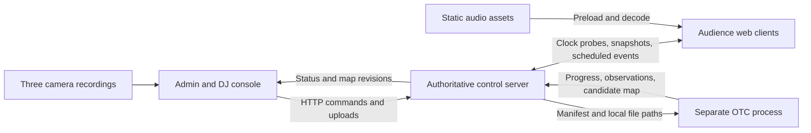

# Audience Orchestra: master implementation plan

Planning baseline: 2026-09-19. This document defines proposed implementation work, not completed features or verified performance.

## 1. Outcome and scope

Build a browser-based concert in which audience phones play different, synchronized musical parts according to their position in the auditorium. An operator calibrates the audience from three uploaded camera recordings, reviews a device map, selects regions, assigns channels, and conducts a prepared set from a multitrack timeline.

The first complete demonstration must work with 12-30 real phones, three camera views, and four prepared stems. The system must also be exercised with 1,500 simulated connections. A simulated load test does **not** establish that the venue Wi-Fi, optical coverage, or 1,000 physical phone speakers will work; those need a venue rehearsal.

The four workstreams are:

1. **Sync and control:** extract the BeatSync clock, own authoritative server state, and implement channel subscriptions and scheduled commands.
2. **Audio and audience client:** extend playback to multiple channels and build joining, readiness, calibration rendering, and the participant experience.
3. **Optical localization:** decode moving phone screens from recordings and produce a confidence-scored audience map.
4. **Admin and DJ console:** upload recordings, review localization, select devices, and operate the shared musical timeline.

### What was inspected

- This workspace was empty and was not a Git repository when planning began. The user subsequently supplied `beatsync-source/`; its relevant clock, playback, server, schema, test, and license files have now been inspected.
- BeatSync uses Bun, Hono, Next.js/React, Zustand, Zod, and Bun tests. Its MIT license identifies copyright (c) 2025 freeman-jiang. This was a source review, not a runtime or acoustic performance test. Bun was not found on this planning shell's PATH.
- **User requirement:** selectively extract reused implementation into this project's main folders. Keep `beatsync-source/` as an unchanged reference; the finished application must build and run without importing or serving anything from it.
- The documentation convention follows `C:\Projects\Lattice\.devcontext`: an index, current architecture, glossary, stage briefs with acceptance criteria and evidence, schema notes, and append-only architecture decisions. Its application architecture is not being copied.

### Initial decisions and assumptions

| Topic | Baseline decision | Verification or revision trigger |
| --- | --- | --- |
| Position | An approximate 2D audience map relative to the stage; no GPS or metric 3D reconstruction | Check ordering against known seats in the venue |
| Audio | Preloaded assets, a common show timeline, and scheduled Web Audio playback | Physical iOS/Android rehearsal |
| Routing | One active logical channel per phone; many simultaneous channels across the crowd | Four channels are sufficient for the first demo |
| Music | Prepared, compatible stems with explicit timeline offsets | Musical rehearsal; no automatic separation or beat matching |
| Calibration | An error-checked temporal packet lasting about 11 seconds initially | Shorten only after camera, decoding, and flash-pattern validation |
| Cameras | Three fixed 4K phones, one primarily covering each audience column, with overlap | Back-row visibility and actual codec/frame timing tests |
| Stack | Bun/Hono backend, Next.js/React frontends, shared TypeScript/Zod, Python/OpenCV worker, FFmpeg/PyAV decoding | Preserve the inspected source stack; pin one compatible Bun version during foundation |
| Deployment | One authoritative control process and one separately executed video worker; static media over HTTP(S) | Scale only if measurements demonstrate a bottleneck |
| Schedule | An illustrative 36-hour implementation window | Team leads compress milestones to the actual deadline |

Do not promise one-second calibration or perfect acoustic alignment across the hall. At full 11-bit utilization, every raw binary word is a valid ID, so a single bad bit can silently identify another phone. Clock synchronization also does not remove speaker latency or the travel time of sound through the room.

### MVP boundary

Include QR join, resume after reconnect, audio unlock, reusable clock synchronization, four channels, calibration capture/upload, device localization with explicit unknowns, manual column fallback, rectangle/lasso selection, scheduled reassignment, prepared multitrack playback, readiness counts, and an emergency mute.

Defer automatic stem separation, live audio streaming, full DAW editing, time stretching, arbitrary audio effects, metric 3D seating reconstruction, continuous camera tracking during music, native apps, and distributed server infrastructure. A DaVinci-style timeline is the interaction reference, not a request to recreate DaVinci Resolve.

## 2. Architecture and four-branch ownership



The WebSocket connection carries control and synchronization messages, never the audio stream or video bytes. The worker cannot block the control event loop or write authoritative assignments. An operator commits a reviewed mapping; the server then owns it.

### Branch and directory matrix

| Team | Feature branch | Exclusive implementation ownership | Independent deliverable |
| --- | --- | --- | --- |
| 1 | `feat/sync-control` | `backend/`, `packages/sync/`, `tools/load/` | Control server and simulated clients, with fake media/OTC adapters |
| 2 | `feat/audio-client` | `client-frontend/`, `packages/audio/`, `tools/client-demo/` | Real browser client driven by a local protocol mock |
| 3 | `feat/otc-localization` | `workers/otc/`, `tools/otc-fixtures/` | CLI converting fixture recordings and a manifest into validated results |
| 4 | `feat/admin-console` | `admin-frontend/`, `packages/selection/`, `tools/admin-demo/` | Full operator workflow against a deterministic mock server |

Designate the Team 1 human lead as integration captain, unless the four teammates choose someone else before splitting. The captain alone edits root package/configuration files, lockfiles, CI, `packages/contracts/`, and shared `packages/testkit/` files. Other teams propose contract changes with examples; ownership does not grant unilateral authority to change another team's interface.

Each team owns its corresponding `.devcontext/stages/` brief and `.devcontext/teams/<team>/` directory. Any team can add a uniquely named ADR. The captain curates shared architecture and schema summaries. Ownership applies to files, not just folders named in a PR description.

Proposed scaffold:

```text
backend/                      # HTTP, WebSocket, registry, routing, job adapter
client-frontend/              # QR landing and audience experience
admin-frontend/               # map, calibration workflow, musical timeline
packages/contracts/           # Zod schemas, generated JSON Schema, examples, codebook
packages/sync/                # clock estimation and time conversion, independent of UI/audio
packages/audio/               # preload, output-clock adapter, scheduled channel playback
packages/selection/           # pure geometry to select device IDs
packages/testkit/             # small shared fixtures and clock/transport test doubles
workers/otc/                  # Python CLI, decoder, tracking, camera registration
tools/{load,client-demo,otc-fixtures,admin-demo}/
fixtures/                     # small synthetic recordings, manifests, expected results
.devcontext/                  # committed development memory; see rules.md
runtime/                      # ignored uploads, recordings, jobs, media, local state
beatsync-source/               # unchanged reference; excluded from active workspaces
```

### BeatSync extraction map

Paths in the first column are relative to `beatsync-source/`. Extract only the required functions and their focused tests, then adapt imports. Do not copy the entire application store or room manager just to obtain a small behavior.

| Inspected source | Destination / owner | Preserve and change |
| --- | --- | --- |
| `packages/shared/utils.ts` (`epochNow`) and NTP constants | `packages/sync/`, Team 1 | Preserve the monotonic-backed `performance.timeOrigin + performance.now()` clock; add injected clocks and explicit epoch handling |
| `apps/client/src/utils/ntp.ts` and `utils/__tests__/ntp.test.ts` | `packages/sync/`, Team 1 | Preserve coded probe-pair validation and minimum-RTT offset selection; move module-global pair state into a session instance |
| `apps/client/src/hooks/useNtpHeartbeat.ts` and its tests | Core lifecycle in `packages/sync/`; thin React adapter in `client-frontend/` | Separate probe scheduling from React and Zustand; reset on reconnect; jitter startup at scale |
| `apps/server/src/routes/websocketHandlers.ts` NTP receive path; `websocket/handlers/ntpRequest.ts` | `backend/src/sync/`, Team 1 | Capture receive time immediately and send time immediately before reply; retain cheap validation even on the fast path |
| `apps/server/src/managers/RoomManager.ts` scheduling, load coordination, and `syncClient` | Focused modules under `backend/src/`, Team 1 | Generalize single-source readiness/playback into per-device/per-show readiness and channel subscriptions |
| `apps/client/src/lib/audioContextManager.ts` | `packages/audio/`, Team 2 | Reuse one AudioContext, resume/interruption handling, wake-lock lifecycle, and the performance/audio clock adapter as appropriate |
| `apps/client/src/store/global.tsx` loading, cache, `schedulePlay`, `playAudio`, pause | `packages/audio/` plus a small client store, Team 2 | Extract buffer/scheduling logic; replace one selected URL/source and automatic playlist advancement with authoritative show/channel playback |
| `apps/client/src/hooks/useWebSocketReconnection.ts`, `websocket/dispatch.ts`, registry patterns | `client-frontend/`, Team 2 | Reuse connection/dispatch patterns; add authenticated identity resume and full revisioned snapshots |
| Relevant parts of `packages/shared/types/` | `packages/contracts/`, captain with Teams 1/2 | Retain Zod validation patterns; define the new protocol rather than retaining unrelated old messages |
| `apps/server/src/__tests__/audioLoadingCoordination.test.ts`, socket tests, `scripts/load-test-demo.ts` | `backend/` tests and `tools/load/`, Team 1 | Port useful scenarios; extend to channels, stale preparation ACKs, and the 1,500-client case |

Source-specific findings that affect the work:

- Probe defaults are 16 measurements, 50 ms startup interval, 25 ms inter-probe gap with 5 ms tolerance, and 2,500 ms steady interval. Preserve a characterized baseline, then measure startup storms and introduce jitter/batching without corrupting pair-gap measurement.
- `epochNow()` already uses a monotonic clock with an epoch-shaped origin. It does not need replacement with `Date.now()`. Some heartbeat/liveness timers separately use wall-clock time; keep scheduling domains explicit.
- `global.tsx` combines clock offset with manual audio nudge and subtracts filtered output latency. **Only pure clock offset belongs in optical timing.** Audio compensation and manual nudge must never move a calibration symbol.
- `audioContextManager.ts` contains `perfTimeToAudioTime()`, but the inspected store playback path also schedules via `AudioContext.currentTime + delay`. Select one characterized output-timing method; do not combine both and compensate latency twice.
- Playback has a single selected source and stops the previous source when creating a new one. The cache is limited to three buffers. Both behaviors need deliberate adjustment for prepared channel switches and four preloaded stems.
- The existing source can have multiple queued tracks; its limitation here is one room-wide playing source, not an inability to list multiple files.
- Its NTP fast path bypasses the general Zod parser. Preserve early timestamps while validating finite timestamps, pair indices, membership, and size before replying.
- The root package pins `bun@1.3.8`, while `mise.toml` specifies Bun `1.3.14`. Resolve this to one tested version; do not carry contradictory runtime pins forward.

Create `THIRD_PARTY_NOTICES.md` and include the complete BeatSync MIT notice when extracting code. Record source path, available upstream revision or source-file hash, destination, retained behavior, deliberate changes, and migrated tests in `.devcontext/beat-sync-extraction.md`. Do not copy chat, music search/providers, analytics, advertising, IP geolocation, the old spatial-volume scene, cloud backups, or bundled commercial songs into the new app unless a concrete requirement emerges. IP/geographic location does not solve seat location.

## 3. Foundation gate: finish before four teams diverge

Budget approximately 60-90 minutes. Team 1 owns the scaffold; all four leads agree on the boundary examples. Teams can run hardware experiments while the scaffold is being prepared.

1. Use the supplied `beatsync-source/`. Record its upstream revision if available, otherwise source hashes, and the extraction map above. Reproduce its unmodified two-device demo and focused tests in a disposable reference copy; record failures without altering the supplied reference.
2. Initialize the repository if needed. Commit these planning documents. Pin one compatible Bun runtime/package manager, the necessary frontend/backend dependencies, Python dependencies, and FFmpeg. Use the source's existing testing approach. New commands must work from PowerShell; do not blindly copy POSIX `rm`, `tee`, or shell environment-assignment scripts.
3. Create the directory skeleton, minimal build/typecheck/test scripts, and `AGENTS.md` pointing every agent to `rules.md`, this plan, and `.devcontext/README.md`.
4. Freeze `protocolVersion: 1` schemas and examples for joins, snapshots, clock probes, calibration, assignments, show transport, and OTC input/output. Use Zod as the authoring source, inferred TypeScript types, and generated JSON Schema for Python validation. Use JSON-compatible wire fields and reject schema-generation drift; avoid separately maintained competing type definitions.
5. Commit an exhaustive 2,048-entry OTC codebook, its encoder specification, and representative golden packets. Team 2 renders these frozen codewords; Team 3 decodes them. Both must pass the same vectors before changing the packet.
6. Supply fixtures for a 30-device crowd, three overlapping views, four channels, one prepared show, and an OTC result containing valid, missing, ambiguous, and duplicate observations. Provide a deterministic clock double and minimal HTTP/WS mocks. No team may require an unmerged sibling branch for its local tests.
7. Define the root command interface in section 8, allocate ports, and add per-team CI checks. Mark commands as scaffolded only once they actually run.
8. Commit and tag this baseline `foundation-v1`; create the four feature branches from that commit. Save their base SHA in the context index.

Do not spend the foundation window reproducing the full application. Its output is executable contracts and test seams. Keep the source tree outside the active workspaces, import aliases, build globs, and production assets. Verify the extracted project in a clean checkout that omits `beatsync-source/`.

### Branch/worktree setup

These are future setup commands, not actions already performed by this planning task. Run after the committed foundation exists. On a shared Windows machine, use separate worktrees outside OneDrive's synchronized directory when practical; each teammate on a different machine can instead use an ordinary clone and the matching branch.

```powershell
# Run from the repository after creating foundation-v1.
# These destination directories must be new or empty.
git worktree add -b feat/sync-control C:/Projects/HTN-worktrees/sync-control foundation-v1
git worktree add -b feat/audio-client C:/Projects/HTN-worktrees/audio-client foundation-v1
git worktree add -b feat/otc-localization C:/Projects/HTN-worktrees/otc-localization foundation-v1
git worktree add -b feat/admin-console C:/Projects/HTN-worktrees/admin-console foundation-v1
```

Never have multiple agents changing branches or installing dependencies in the same working directory. Each team lead assigns agents non-overlapping files or additional private worktrees. The four named branches remain the long-lived team integration branches.

## 4. Shared contracts and invariants

The following is the baseline specification to implement in `packages/contracts/`. After foundation, the executable schemas and approved ADRs define the exact wire representation; update this plan when a material decision changes.

### Identity, time, and state

| Field or entity | Required meaning |
| --- | --- |
| `sessionId` | Unique concert session; every message and recording manifest belongs to one session |
| `serverEpoch` | Changes whenever the server's monotonic clock origin changes; old scheduled actions are invalid |
| `deviceId` | Integer **0 through 2047**, allocated sequentially and never recycled during a session; zero is valid |
| `resumeToken` | Opaque credential for reclaiming a device identity; separate from the public optical ID |
| `commandId` | Unique mutation ID; retrying the same command has the same result |
| `revision` | Server-assigned monotonically increasing state revision; consumers reject stale state |
| `serverMs` | Milliseconds from the server's monotonic-backed `epochNow()`; always paired with `serverEpoch`, never fresh `Date.now()` values |
| `effectiveServerMs` | Future execution time, expressed in the same epoch; receipt time is not execution time |
| `trackId` | One immutable audio asset with URL, content hash, byte size, duration, and decoded format |
| `channelId` | Logical musical lane to which phones are assigned; distinct from an audio asset |
| `showRevision` | Immutable prepared timeline version; clips reference tracks, channels, offsets, and gain |
| `mapRevision` | Committed location snapshot used for selections and assignments |

An allocated ID survives a network reconnect. Authenticate the resume token; never allow a client to claim another ID by number. Define concurrent-tab behavior: a new authenticated connection replaces the previous connection for that identity. A second independent join without the token gets a new ID. Reject joins after capacity rather than wrapping the counter.

Use one authoritative state writer. For the MVP, keep hot state in memory and serialize durable identity/show/map/assignment mutations into an atomic local JSON checkpoint; serialize writes and acknowledge durable mutations only after success. Do not persist every clock probe or heartbeat. On restart, restore identities and the last committed show/map, issue a new clock epoch, clear pending actions, and return to stopped. Clients resynchronize before becoming ready. Adapt existing BeatSync storage if it already solves this simply.

### Clock boundary

`packages/sync/` exposes `nowServerMs()`, `toLocalPerformanceMs(serverMs)`, quality/age information, and synchronization lifecycle hooks. It does not import React, canvas, Web Audio, or the optical decoder.

For an NTP-style exchange, let `c0/c3` be client send/receive times and `s1/s2` server receive/send times, all in milliseconds on their respective monotonic clocks:

```text
offset(server - client) = ((s1 - c0) + (s2 - c3)) / 2
networkDelay = (c3 - c0) - (s2 - s1)
```

Start from the inspected coded-pair/minimum-RTT estimator and preserve its focused tests. Add sample age and measured quality; add drift fitting only if measured drift warrants it. Estimated uncertainty is a quality signal, not proof of true clock error under asymmetric networks. Reprobe periodically with jitter, and immediately after reconnect or returning to the foreground. With BeatSync's epoch-shaped client clock, `toLocalPerformanceMs(S) = S - offsetEstimate - performance.timeOrigin`; do not subtract an audio nudge here. Inject clock and transport for deterministic tests.

### Minimum HTTP and WebSocket surface

Endpoint names below are the initial contract. Commands return either a validated result and revision or a structured error; a transport ACK means receipt, not successful execution.

| Interface | Responsibility |
| --- | --- |
| `POST /api/sessions/:sessionId/join` | Allocate/resume identity and issue the participant connection credential |
| `GET /api/sessions/:sessionId/snapshot` | Role-filtered current state, including pending scheduled actions |
| `GET /api/assets/:trackId` | Static/cacheable media, preferably served independently from control |
| `POST /api/assets` | Operator-only audio upload/registration with validated asset metadata |
| `POST /api/calibrations` | Create run and freeze participants, codebook version, palette, timing, and run tag |
| `POST /api/calibrations/:runId/arm` | Commit future start after preparation/readiness |
| `POST /api/calibrations/:runId/uploads` | Stream one camera file with camera ID, primary column, and capture metadata |
| `POST /api/calibrations/:runId/jobs` | Enqueue an OTC job referencing completed uploads and camera geometry |
| `GET /api/jobs/:jobId` | Read progress, errors, diagnostics, and candidate result |
| `POST /api/calibrations/:runId/commit-map` | Commit reviewed results against the expected current map revision |
| `POST /api/assignments` | Assign an explicit device-ID set to a channel at a future time |
| `PUT /api/show` | Validate/save a prepared show revision while stopped |
| `POST /api/transport` | Prepare/play/pause/seek/stop with authoritative scheduled state |
| `POST /api/mix` | Schedule channel/master gain and mute/solo changes without modifying asset timing |
| `POST /api/panic` | Immediately invalidate pending playback and broadcast mute |
| WebSocket | `clock.probe/reply`, `state.snapshot`, `calibration.prepare/ready/arm/result`, `assets.prepare/ready`, `assignment.prepare/ready/commit`, `transport.prepare/ready/commit`, `mix.commit`, `device.status`, `panic` |

Use an envelope with `protocolVersion`, `sessionId`, `serverEpoch`, `type`, `messageId`, and `payload`; state events also carry `revision`, and scheduled events carry `effectiveServerMs`. Client clock probes correlate replies with their probe ID. Client mutation requests carry `commandId` and relevant expected revision. Snapshot/resume is mandatory; correctness must not depend on receiving every broadcast.

The public QR code only grants participant access. Admin commands/uploads require a separate operator credential. Bind a participant socket to its authenticated device, validate message shape/size, and limit join/upload rates. The OTC worker accepts server-resolved local file paths; never execute an uploaded filename as shell code. Do not build a general account system.

### Calibration and worker interchange

`CalibrationManifest` contains `protocolVersion`, `sessionId`, `serverEpoch`, `runId`, `runTag`, frozen `participantIds`, `startServerMs`, packet/palette/codebook versions, `symbolMs`, and one entry per camera: `cameraId`, `primaryColumn`, local video path/hash, rotation metadata, exclusion ROIs, and optional ordered map anchors.

`OtcResult` contains the same run identity, input hashes, decoder version, per-camera diagnostics, observations, candidate locations, and rejected/ambiguous observations with reasons. Each observation records camera/frame coordinates, track ID, decoded device ID if accepted, sampling/correction evidence, and a quality score. A score is not a calibrated probability unless measurements establish that interpretation.

A location records `deviceId`, normalized `x/y` or null, `column`, `mappingMode`, source cameras, `decodeScore`, mapping residual/uncertainty where available, and status: `localized`, `coarse`, `ambiguous`, or `unseen`. Distinguish a manually selected column from an optically decoded position. Never turn an unknown into `(0,0)`.

The Python CLI reads a manifest and writes a schema-valid result plus optional debug overlays. It emits structured progress on stdout and diagnostic logs on stderr. The server owns queuing, timeouts, cancellation, and exit/error handling. Default to one job at a time; no Redis, broker, or Python HTTP service is required.

### Coordinates and selections

Canonical map: stage at the top, `y=0` nearest the stage, `y=1` at the back; `x=0` is the audience's left **while facing the stage**, `x=1` their right. Camera image coordinates are top-left-origin pixels and may be horizontally reversed relative to this map. Explicitly verify orientation with a known person in each corner.

Column names `left`, `center`, and `right` always use that audience convention. A selection resolves to an explicit ID set and `mapRevision`; later camera processing cannot silently change its membership. Reject a stale-map assignment and ask the operator to reselect. Last committed assignment wins for overlapping selections at the same effective time; server revisions determine order. Unassigned/unlocalized devices remain silent unless explicitly put into a manual fallback channel.

## 5. Optical calibration: Team 3's critical path

### 5.1 Prove the optics before optimizing the algorithm

Within the first few hours, film 12-30 actual phones at representative near/middle/back distances. Use the intended cameras, lenses, lighting, orientation, and recording format. Inspect original-resolution crops for screen size, saturation, blur, and whether adjacent screens can be separated. Include hand movement and partial coverage.

As a rough planning calculation, a 7 cm screen at 30 m with a 60-degree horizontal field of view occupies only about `3840 * 0.07 / (2 * 30 * tan(30 degrees)) = 7.8` horizontal pixels before tilt/blur. This is not a camera measurement. Aim for roughly eight or more usable pixels across the smallest screen, then establish the actual decoder limit experimentally. 4K alone does not establish feasibility.

If back-row screens are indistinguishable, change framing, camera position, lens, or the participating area immediately. Code cannot recover two fully overlapping emitters or an invisible screen. Keep all three cameras stationary, use the original files, record several seconds before/after calibration, and lock focus/exposure/white balance where supported. Confirm whether the phone actually produces H.264/HEVC and constant/variable frame timing. Prefer 4K30 if that is the most reliable common mode; use 60 fps only when tested.

### 5.2 Packet v1: eleven identity bits with redundancy

Keep the 11-bit ID capacity, but encode it as an **extended Hamming (16,11) codeword with minimum distance 4**. This supports single-bit correction and double-bit detection under the corresponding error assumptions; larger errors can still turn into a wrong valid word. Tracking, repeated evidence, participant filtering, and rejection remain necessary.

Encoder convention, frozen in the shared codebook:

- Number transmitted codeword positions 1 through 16.
- Put ID bits most-significant first into positions `3,5,6,7,9,10,11,12,13,14,15`.
- Positions `1,2,4,8` hold even parity over positions 1-15 whose binary index contains that parity bit.
- Position 16 is overall even parity over all 16 positions.
- Transmit positions 1 through 16 in that order. ID `0` encodes to all zeros; ID `2047` to all ones. Zero must never mean missing.

Use two camera-tested screen colors, represented by exact RGB values in the manifest; the user's blue/red idea is one candidate, not a hard-coded decoder assumption. Use pilot measurements to classify colors rather than ideal RGB thresholds. Prefer a palette without saturated red after testing. No per-device imagery, text, or animation may cover the calibration area.

Initial symbol duration is **200 ms**. The complete packet is:

| Slots, zero-based | Screen state | Purpose |
| --- | --- | --- |
| 0-1 | Neutral/dark | Leading guard |
| 2-3 | Color 0 | Per-screen/camera color pilot |
| 4-5 | Color 1 | Per-screen/camera color pilot |
| 6-12 | `1110010` | Shared timing preamble |
| 13-20 | 8-bit `runTag`, MSB first | Detect clips from the wrong calibration run |
| 21-36 | 16-bit codeword | Identity pass A |
| 37-52 | Bitwise complement of the same codeword | Identity pass B; decoder inverts it before comparison |
| 53-54 | Neutral/dark | Trailing guard |

Total: **55 symbols / 11 seconds**. Allocate run tags without reuse within a concert session; after 256 calibrations begin a new session rather than wrap. The full `runId` remains the authoritative manifest key. The tag detects ordinary stale-clip mixups; it is not authentication. Incorrect/ambiguous tags reject an observation or clip, never get silently repaired into the desired run.

A 200 ms symbol gives approximately six 30 fps frames before transition rejection. At worst, alternating symbols form 2.5 opposing color cycles per second; inspect the actual pattern and palette against the [W3C flash guidance](https://www.w3.org/WAI/WCAG22/Understanding/three-flashes-or-below-threshold.html). Provide a skip-calibration/manual-column route. The web content threshold is not a blanket certification of an auditorium-wide display. Do not accelerate the packet just to meet an assumed one-second goal.

### 5.3 Client and server sequence

1. Freeze a run's participant IDs. Only joined, foreground, opted-in, sufficiently synchronized phones are eligible. New joiners wait for the next calibration or use manual assignment.
2. Send `calibration.prepare` with the full immutable packet/manifest. Clients verify support and acknowledge readiness for that exact run and version.
3. Confirm all three camera operators are recording; arm for a common future time, initially at least three seconds ahead. Freeze the ready subset and report exclusions. Do not wait indefinitely for every registered phone.
4. The client renders `slot = floor((nowServerMs() - startServerMs) / symbolMs)` from the pure sync clock on each animation frame. Do not increment bits with a chain of timers. A skipped frame must not shift every later bit.
5. If a phone misses the run start, becomes hidden, or loses adequate timing, report failure; do not begin its own delayed packet. Log requested symbol transitions and observed animation-frame lateness as diagnostics, not proof of physical display timing.
6. Upload original recordings labeled with `runId`, camera ID, and primary column. Freeze the completed file hashes before processing. Retain the previous committed map until the new result has been reviewed.

### 5.4 Offline pipeline

1. **Validate and decode video.** Check session/run identity, tag, hashes, duration, codec, rotation, and dimensions. Read actual presentation timestamps through FFmpeg/PyAV; do not use `frameNumber / nominalFPS` for variable-frame-rate clips. [FFprobe](https://ffmpeg.org/ffprobe.html) exposes frame-level information. Stream frames; do not load three uncompressed 4K movies into memory.
2. **Find temporal phase per camera.** Detect pilot/preamble changes in plausible audience ROIs, correlate against the known packet, and estimate its start in clip PTS. The cameras do not need synchronized record buttons. Refine a bounded local phase per screen to accommodate display/rolling-shutter differences; an unconstrained phase search can invent IDs.
3. **Detect candidate screens.** Start with pilot-color/brightness masks, connected components, size/aspect limits, and explicit stage/light exclusion masks. Detect at sufficient resolution to preserve back-row screens. Global phase detection may use reduced frames; final color sampling uses native-resolution ROIs.
4. **Track through the packet.** Use gated position/size/motion association and local optical flow as needed. Search neighboring candidates; avoid a dense 1,000-by-1,000 matching problem on every frame. Track the screen, not a fixed pixel. Split/merged blobs, implausible jumps, and identity crossings reduce confidence or terminate a track. Short missing intervals create erasures; do not interpolate a color across an occlusion.
5. **Sample symbols.** Reject frames near transitions (initially the outer 25% at either edge of each slot). Use robust interior color samples relative to the pilots; reject saturated, mixed, blurred, or tiny observations. Require enough interior evidence per slot. Mark uncertain bits as erasures rather than thresholding everything into 0/1.
6. **Decode conservatively.** Undo pass B's complement. Decode only within the frozen codebook/participant set and require a unique candidate under the chosen error/erasure bound. For a distance-4 code, the conservative bound is `2 * errors + erasures < 4`. Do not choose the nearest active ID without that bound. Prefer agreement from both passes; conflicts stay ambiguous. A one-pass salvage is a separately labeled review candidate until field evidence justifies automatic acceptance.
7. **Attach identity to observed position.** Preserve the track trajectory and use a documented representative position, initially its median screen center over accepted samples. Store camera-space evidence and uncertainty, not just the final dot.
8. **Register views and fuse duplicates.** Use decoded common IDs, not visual similarity of screens, as correspondences. Apply the mapping rules below. Produce one canonical location per device, with diagnostics explaining rejected alternatives.
9. **Export review material.** Save schema-valid JSON, annotated stills/optional short overlays, decode counts, rejected reasons, camera residuals, processing time, and input hashes. All debug outputs live outside Git unless small and synthetic.

Keep the MVP classical and inspectable. Do not train a detector or implement SLAM unless the early experiments show the simpler approach cannot meet the agreed demonstration scope.

### 5.5 Three-camera registration and mandatory fallback

Implement the manual geometry path first so the demo does not depend on automatic stitching:

- The operator labels each camera's primary column and marks a seating ROI plus four ordered anchors: front-left, front-right, back-right, back-left, all in the canonical audience convention. Warp that approximate seating surface into its normalized column strip. Camera-space screen positions remain available for inspection.
- The resulting map is an approximate audience layout, not measured floor coordinates. Tiered rows, different phone heights, and camera translation create parallax. A homography models a plane or the appropriate rotational case; it does not generally solve arbitrary 3D crowds. [OpenCV's homography tutorial](https://docs.opencv.org/4.x/d9/dab/tutorial_homography.html) documents the underlying geometry.
- Add automatic overlap registration using accepted common device IDs. At least four non-collinear pairs are needed to fit a homography; require more, initially eight well-spread matches, plus inlier and held-out residual checks before trusting it. A narrow strip of matches must not authorize extrapolation across the entire hall.
- Prefer a decoded view from the device's valid primary-column ROI, then measured observation quality. Fuse positions only when they agree within the accepted mapping tolerance. Conflicting IDs in the same camera, reflections, or contradictory cross-camera positions must be flagged, not averaged away.
- If shared IDs are insufficient, the overlap graph is disconnected, or parallax produces bad residuals, retain the manual column transforms. Never require all three cameras to stitch before any locations are usable.
- If geometry itself cannot establish a trustworthy row coordinate, mark the device `coarse` and expose column selection only. Participants who skip/fail optical calibration can explicitly choose left/center/right; mark that source as manual. Do not claim a self-selected column is an optical fix.

Recalibrate only a declared target set if necessary. On map commit, replace those targets' locations, mark failed targets unseen/ambiguous, and retain nonparticipants' previous positions. Reject an older run trying to overwrite newer locations. Permit only one active calibration run at a time in the MVP. Moving to a new seat after calibration requires recalibration or manual reassignment; ordinary hand movement does not imply continuous seating tracking.

### 5.6 Failure matrix

| Condition | Required behavior |
| --- | --- |
| Mild hand motion | Track moving ROI; decode using interior samples |
| Partial cover or dropped frames | Erasures, code-bound check, second-pass evidence |
| Complete occlusion or two indistinguishable overlapping screens | Unknown; retry/manual route |
| Two tracks cross or blobs merge | Reject ambiguous association instead of swapping identities |
| Rolling shutter or transition smear | Per-track phase/guard windows; mixed-frame rejection |
| Color shift, HDR, exposure pumping | Pilot-normalized classification; flag insufficient separation |
| Stage lights, projector, reflections | Exclusion masks, packet/tag match, duplicate-location checks |
| Handheld camera shake | Prefer re-recording on a fixed support; add stabilization only if essential |
| Missing one camera / no overlap | Process available cameras and use manual column geometry |
| Wrong run or source file rotation | Validate tag/manifest; normalize rotation before tracking |

## 6. Synchronized multichannel playback and participant UI

### Team 1: control, subscriptions, and reusable sync

Deliver in this order:

1. Extract and characterize the BeatSync clock module and fast timestamp reply path. Make two independent clock clients work without React or audio; preserve pair/offset tests and add reconnect/epoch cases.
2. Implement registry, authenticated resume, role-filtered snapshots, and validated command envelopes. Participants receive their own status/assignment and relevant global state, not every other phone's telemetry.
3. Implement server-owned membership sets for `session/<id>/channel/<channelId>`. A phone subscribes only through its authorized assignment; a UI cannot spoof another channel or mutate the concert.
4. Implement preparation/readiness/commit for calibration, asset loading, transport, and reassignment. ACKs name the exact preparation, asset hashes, show revision, and assignment revision; old ACKs cannot satisfy a new barrier. The admin is not automatically counted as an audio-ready phone.
5. Add streamed upload storage, a fake OTC job adapter followed by the real CLI adapter, map commits, checkpoint recovery, and the load harness.

A phone reports separate connection, clock, foreground, audio-unlocked, assets-decoded, and assignment states. These are not interchangeable. Start with a measured clock-quality eligibility threshold of about 20 ms; tune from test results and report the configured value. Avoid broadcasting the full registry after each probe/join; aggregate operator telemetry to roughly 1-2 updates per second.

For normal concert cues, start with at least three seconds of lead time **after preparation is ready**. Reuse BeatSync's measured network-delay approach to tune this. The operator sees ready/expected/excluded counts and can postpone or explicitly run the ready subset. One slow client must not freeze the entire show.

### Team 2: audio engine and audience client

Deliver in this order:

1. Extract AudioContext management, buffer loading, scheduling, and necessary mobile handling into `packages/audio/`. Preserve a known two-phone click demo before changing playback state.
2. Build join/resume and one clear user gesture to enable audio. Show loading/sync/readiness honestly; a running AudioContext is required before claiming audio readiness. Handle interruptions and re-entry with a visible resume action. Browser autoplay requires deliberate handling; see [Chrome's Web Audio guidance](https://developer.chrome.com/blog/web-audio-autoplay).
3. Render the exact frozen OTC packet from the shared clock and codebook. Use a lightweight full-screen surface without React state updates for each animation frame. Offer calibration skip/manual column, keep-screen-open instructions, and a supported wake lock with fallback instructions.
4. Preload/decode the prepared show assets, then play only the assigned channel. Use one AudioContext per phone, a gain node for its channel, and a master gain. A channel may contain successive clips; MVP forbids overlapping clips within the same channel while allowing all channels to play concurrently across devices.
5. Implement scheduled assignment changes, pause/resume/seek/stop, mute, reconnect snapshots, and correct late joins. Every source node belongs to a transport/assignment revision; cancel superseded nodes and ignore stale completion callbacks. Do not let a local `onended` callback advance the whole concert.

### Timeline and timing semantics

Each show clip has `clipId`, `channelId`, `trackId`, `timelineStartMs`, `sourceOffsetMs`, `durationMs`, and `gain`. Validate source bounds and prohibit channel overlaps in the MVP. Align prepared stems to a common musical origin; mixing percussion from one song with melody from another requires compatible tempo/key and explicit preparation, not just a shared clock.

A playing transport snapshot includes `showRevision`, `transportRevision`, `startServerMs`, and `positionMsAtStart`. At server time `S`, the show playhead is:

```text
showPositionMs = positionMsAtStart + (S - startServerMs)
clipSourceMs = sourceOffsetMs + (showPositionMs - timelineStartMs)
```

Only play a clip when the show position is within its scheduled interval. Pausing holds a fixed show position. Seeking replaces the transport revision and schedules a new start; all channels use the same revised position. The admin playhead is derived from this state, not an independently accumulating UI timer.

Convert a cue's server time to client performance time using `packages/sync/`, then to AudioContext time using one tested output-clock strategy. Schedule with Web Audio source/gain methods. JavaScript timers may maintain a queue but must not be the mechanism that starts sound at the deadline. The [Web Audio specification](https://www.w3.org/TR/webaudio/#dom-audiocontext-getoutputtimestamp) defines the relationship returned by `getOutputTimestamp()`; feature-detect valid support and test the fallback. Never subtract output latency again when the chosen mapping already accounts for it.

During reassignment, prepare the target assets first, then atomically change subscription and schedule a short gain ramp at the common switch time. Retain the old channel until the target is ready or explicitly mute the device; do not silently play a missing asset. Preserve the common playhead instead of restarting the target track at zero. For a late cue, compute a new future rendezvous from current authoritative state or remain silent and request resync; calibration packets are never locally restarted late.

Panic invalidates all queued audio actions and mutes immediately on receipt. Add a bounded playback lease, initially 10 seconds renewed by control heartbeats, so disconnected phones stop instead of playing indefinitely. A disconnected phone cannot receive an instantaneous panic; expose the lease bound and test it. A fresh authenticated snapshot and explicit ready state are required before it resumes.

### Media, memory, and network budgets

- Prefer a prepared 60-90 second demonstration with four mono stems and hashes. Confirm decoded start alignment; encoder padding or silence can offset an otherwise synchronized track.
- At 48 kHz, mono, float32, one 60-second decoded stem occupies about 11.52 MB; four occupy 46.08 MB before browser/temporary buffers. Budget by decoded bytes, pin active/prepared assets, and do not blindly retain BeatSync's three-buffer limit or decode an unlimited library.
- At 128 kbit/s, four 60-second stems total about 3.84 MB per phone, or 3.84 GB for 1,000 phones. Preload well before the performance. A CDN helps server egress but does not create venue Wi-Fi capacity. Measure local versus public hosting and actual audience reachability.
- Serve immutable assets with hashes and cache headers; verify CORS, HTTPS/WSS, and phone reachability on the chosen network. Upload camera videos outside the time-critical cue path. Limit worker CPU and upload concurrency while synchronizing clients.
- Use built-in phone speakers for the rehearsed path. Bluetooth, locked screens, hardware mute/volume, and OS interruptions require real device checks; a browser cannot force system volume or brightness.
- Sound propagation is approximately 2.9 ms per metre, so a 30 m path difference is roughly 87 ms. This is a physical planning estimate, not a measured venue delay. Arrange spatial call-and-response or nearby instrument groups and rehearse from several seats. No single per-device delay makes all speakers arrive simultaneously at every listener.

## 7. Admin console: Team 4's workstream

Build against a deterministic mock immediately, then replace the adapter with the real server without rewriting components.

### Operator workflow

1. **Session:** display the participant QR/link, separate connected/synchronized/audio-ready/localized counts, channel counts, and a persistent mute control.
2. **Calibration:** show camera instructions, prepare/ready/arm states, countdown, and three upload slots. Each slot accepts a camera ID, audience-column label, original video, and geometry anchors/exclusion masks. Show upload and worker progress separately; failure of one upload must not discard successful ones.
3. **Review:** display camera stills with decoded IDs and the normalized audience map. Filter accepted/coarse/ambiguous/unseen, inspect evidence, correct column/orientation, rerun a target set, and commit the map. Show how many devices each camera contributed and whether registration used overlap or manual anchors.
4. **Assign:** rectangle and lasso selection, column presets, explicit selected-ID count, channel color, clear assignment, and a preview before scheduling changes. Unknowns stay in a separate list. Keep a one-step restore of the previous assignment set for operator mistakes.
5. **Perform:** a shared time ruler/playhead, one lane per channel, visible clip blocks/waveforms, play/pause/stop, seek, gain, mute/solo, cue markers, and readiness for the next cue. Clip dragging/trim may be done while stopped; live edits use scheduled transport/mix commands. Offline-generated waveform peaks or browser-computed peaks are sufficient; waveform rendering must not delay playback.

Implement selected-ID geometry as pure functions in `packages/selection/`. Render 1,500 dots with canvas/SVG or an equivalently measured approach; avoid making every telemetry message rerender the entire interface. Display server-confirmed versus pending actions distinctly. On stale revisions or lost connection, show the conflict and refresh authoritative state rather than presenting a successful local change.

First milestone: a mock-driven walkthrough from three uploads to a colored map, selection, assignment, and a moving four-lane playhead. Final milestone: the same walkthrough drives real phones and shows an explicit fallback when localization is incomplete.
